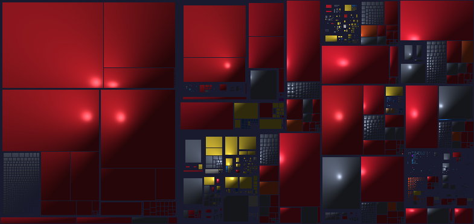

# AtlayaView


Fast local disk space visualization for Windows with cushion treemaps, a WPF desktop UI, and an optional native Rust renderer.

AtlayaView scans one or more drives and turns used storage into an instantly readable treemap, making large folders and files visible at a glance.

**Website:** https://atlaya.capecter.com  
**Source Repository:** https://github.com/Morfyuum/AtlayaView  
**Releases:** https://github.com/Morfyuum/AtlayaView/releases  
**Public Downloads:**  
Full: https://github.com/Morfyuum/AtlayaView/releases/download/v2.0.35/AtlayaView-2.0.35-win-x64-full.zip  
FX: https://github.com/Morfyuum/AtlayaView/releases/download/v2.0.35/AtlayaView-2.0.35-win-x64-fx.zip


## Screenshots




## Highlights

- Local-first desktop application for Windows with no cloud dependency.
- WPF frontend targeting .NET 9.
- Native Rust renderer for high-performance treemap drawing, with automatic fallback to the managed C# renderer if the DLL is unavailable.
- Portable release model with two variants: self-contained and framework-dependent.
- Built-in update check and self-updater for published releases.
- User interface available in German, English, French, Italian, and Spanish.

## Tech Stack

- C# / WPF / .NET 9
- Rust native renderer in [native/atlaya_renderer](native/atlaya_renderer)
- PowerShell release automation via [build-hybrid.ps1](build-hybrid.ps1)

## Building

Requirements:

- Windows
- .NET 9 SDK
- Rust toolchain with cargo

Build the application:

```powershell
dotnet build .\AtlayaView.csproj -c Release
```

Build the Rust renderer only:

```powershell
cd .\native\atlaya_renderer
cargo build --release
```

Create both Windows release variants:

```powershell
pwsh -File .\build-hybrid.ps1 -Configuration Release
```

## Release Variants

- Self-contained: includes the .NET runtime and runs without a separate runtime installation.
- Framework-dependent: smaller download that requires an installed .NET 9 runtime.

## Project Structure

- [Core](Core): scanning, rendering, updates, settings, and application logic.
- [Dialogs](Dialogs): WPF dialogs for settings, updates, filters, and about screens.
- [ViewModels](ViewModels): presentation-layer state.
- [Resources](Resources): icons, screenshots, and shared styles.
- [native/atlaya_renderer](native/atlaya_renderer): Rust renderer used by the desktop app.

## Downloads

Current public downloads:

- Full: [AtlayaView-2.0.35-win-x64-full.zip](https://github.com/Morfyuum/AtlayaView/releases/download/v2.0.35/AtlayaView-2.0.35-win-x64-full.zip)
- FX: [AtlayaView-2.0.35-win-x64-fx.zip](https://github.com/Morfyuum/AtlayaView/releases/download/v2.0.35/AtlayaView-2.0.35-win-x64-fx.zip)

## Releases

AtlayaView uses two Windows release variants:

- Full: self-contained package with the .NET runtime included.
- FX: framework-dependent package for systems that already have .NET 9 installed.

All public releases are published on GitHub:

https://github.com/Morfyuum/AtlayaView/releases

## License

This project is licensed under the MIT License. See [LICENSE](LICENSE).